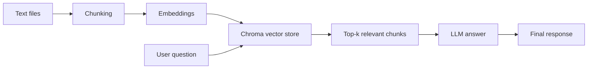

# Minimal RAG Prototype (CLI)

This project is a **hands-on Retrieval-Augmented Generation (RAG) prototype** designed to show how physicians (or clinical staff) could ask free-text questions about patient records and receive context-aware answers.  

The prototype:
- Loads a small set of clinical text files (e.g., MIMIC-style notes).
- Splits documents into chunks for better retrieval.
- Stores embeddings in a local **Chroma** vector store.
- Retrieves the most relevant context for a user’s query.
- Uses a **public LLM (OpenAI)** or a **local LLM (Ollama)** to generate an answer strictly from the retrieved context.

---

## 🎯 Objective
The goal is to demonstrate how RAG can help a physician **quickly find clinical facts** from large, unstructured records (like discharge summaries or radiology reports).  

For example:  
> *“Which lung had the cavitary lesions on the chest CT?”*  
The system retrieves the relevant CT report snippet and responds:  
**“The left lung had the cavitary lesions on the chest CT.”**

---

## 📂 Data Source
We use sample text inspired by the **MIMIC clinical dataset** (Medical Information Mart for Intensive Care).  
- MIMIC is a large, de-identified clinical database widely used in research.  
- Here, only a few **dummy `.txt` notes** are included (radiology reports, discharge summaries).  
- The pipeline is generic: you can replace these with any text files (clinical or non-clinical).

---

## 🛠️ Stack
- **Chunking**: Simple sliding window  
- **Vector Store**: Chroma (cosine similarity)  
- **Embeddings**: Ollama `nomic-embed-text`  
- **LLM for Answering**:  
  - Default: OpenAI (`gpt-4o-mini`) – public API  
  - Optional: Ollama local model (`llama3.2`)  

---

## 🔄 Architecture

## Setup
1) Create Python Environment
python -m venv .venv && source .venv/bin/activate
pip install -r requirements.txt

2) Add Text Files
mkdir -p data
Copy at least 3 `.txt` files into ./data

3) Start Ollama (for embeddings)
ollama serve
ollama pull nomic-embed-text

4) Set OpenAI API Key
export OPENAI_API_KEY="sk-xxxxxxxx"

## 🚀 Running the RAG Bot
Build the Index (embeds & stores chunks)
python rag_cli.py --rebuild

Ask Questions (using OpenAI)
python rag_cli.py --provider openai

Fully Local Answering (using Ollama)
python rag_cli.py --provider ollama --model llama3.2

## Tools and Models Used

ChromaDB – Vector store
Ollama nomic-embed-text – Embeddings
OpenAI GPT Models – Cloud LLMs
Ollama LLaMA 3.2 – Local LLM

## Estimated Time Spent

Environment setup & dependencies: ~20 minutes
Implementing RAG pipeline (indexing, retrieval, answering): ~1.5 hours
Testing & validation: ~40 minutes
Total: ~2.5 hours

